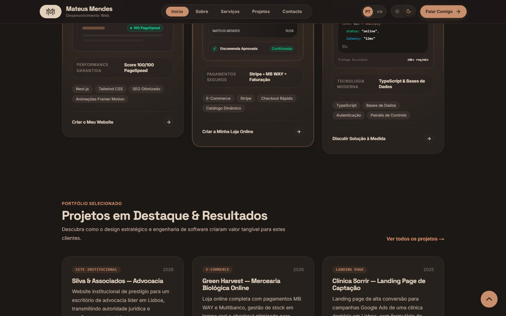
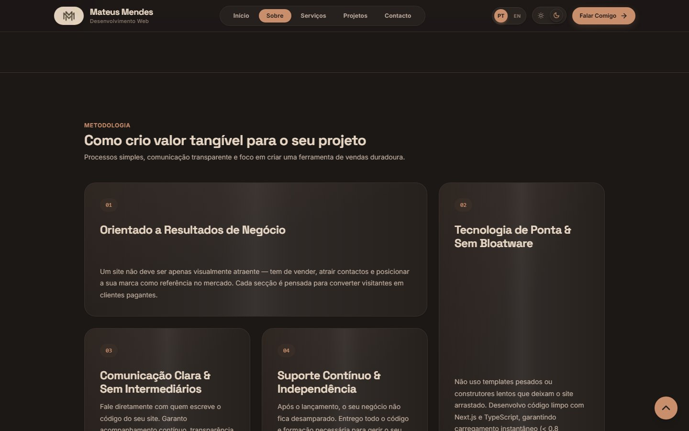
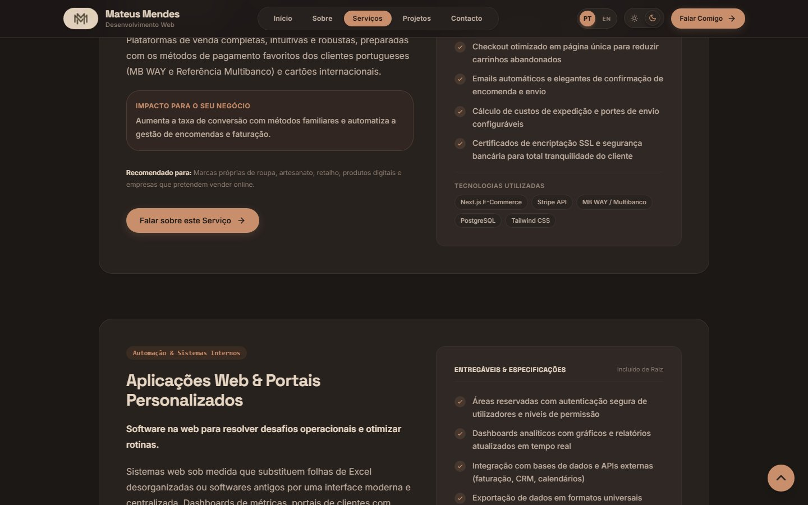
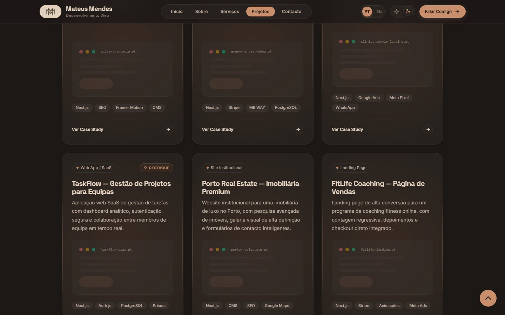
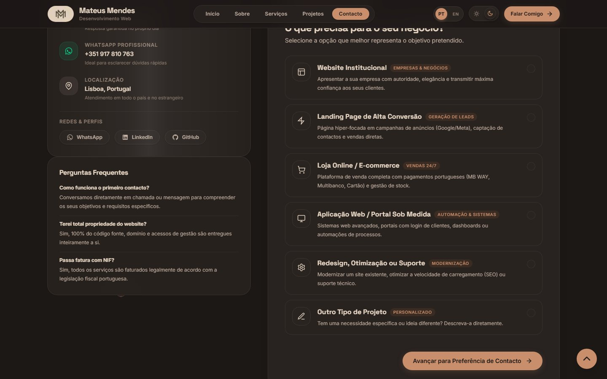
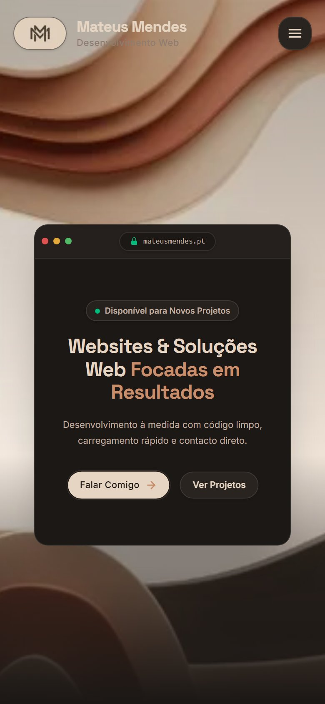

<div align="center">

# Portfólio Mateus Mendes

**Website institucional de um programador web freelance — design, engenharia e resultados mensuráveis.**

**▶ [mateusmendes.pt](https://mateusmendes.pt)**

[](https://nextjs.org)
[](https://react.dev)
[](https://www.typescriptlang.org)
[](https://tailwindcss.com)
[](#performance)


</div>

---

## Sobre o projeto

Site de cinco páginas que apresenta os serviços, a metodologia e os projetos de um programador web freelance, com formulário de contacto funcional.

Feito para três coisas, por esta ordem:

1. **Converter visitantes em contactos** — CTA claro, formulário em três fases com validação em tempo real e envio direto para o email.
2. **Carregar depressa** — Lighthouse 92/100 em telemóvel, CLS 0, sem bibliotecas de UI pesadas.
3. **Ser encontrável** — `sitemap.xml`, `robots.txt`, metadados e Open Graph por página, HTML semântico.

## Funcionalidades

- **PT / EN** — alternância de idioma em cliente, sem recarregar a página.
- **Tema claro/escuro** — respeita a preferência do sistema (`next-themes`).
- **Animações** — entradas com scroll, tilt 3D nos cartões e um scroll horizontal guiado no processo de trabalho (`framer-motion`), tudo desativado automaticamente para quem usa *reduced motion*.
- **Formulário de contacto** — três fases, honeypot anti-spam, rate limiting por IP, validação partilhada entre cliente e servidor (Zod) e envio via Resend com `Reply-To` para o visitante.
- **SEO técnico** — canonical por página, sitemap gerado, robots, Open Graph e Twitter Cards.
- **Acessibilidade** — skip-link para o conteúdo, foco visível, `prefers-reduced-motion` respeitado em CSS e framer-motion.

## Stack

| Camada | Tecnologia |
| --- | --- |
| Framework | Next.js 16 (App Router, Turbopack) |
| Linguagem | TypeScript (modo estrito) |
| UI | React 19 + Tailwind CSS v4 |
| Animações | framer-motion 13 |
| Validação | Zod 4 (partilhado entre cliente e servidor) |
| Email | Resend |
| Tema | next-themes |

## Correr localmente

Requisitos: [Node.js](https://nodejs.org) ≥ 20.9 e npm.

```bash
git clone https://github.com/MateusMendes17/portofolio-mateus.git
cd portofolio-mateus
npm install
npm run dev
```

Abre <http://localhost:3000>.

### Variáveis de ambiente

Copia o exemplo e preenche (o site funciona sem elas, mas o formulário só envia emails com a chave do Resend):

```bash
cp .env.local.example .env.local
```

| Variável | Obrigatória | Descrição |
| --- | --- | --- |
| `RESEND_API_KEY` | Sim (em produção) | Chave da API do Resend. Sem ela, o formulário responde `500` em produção — de propósito, para nunca fingir sucesso. |
| `CONTACT_EMAIL` | Não | Email que recebe os contactos. Por omissão, o email público do site. |
| `RESEND_FROM` | Sim (em produção) | Remetente com domínio verificado no Resend. Por omissão `onboarding@resend.dev`, que só serve para contas de teste. |
| `NEXT_PUBLIC_SITE_URL` | Não | URL base do site, usada no sitemap e nos metadados. |

## Scripts

| Comando | O que faz |
| --- | --- |
| `npm run dev` | Servidor de desenvolvimento (Turbopack) |
| `npm run build` | Build de produção |
| `npm run start` | Serve a build de produção |
| `npm run lint` | ESLint |
| `npm run typecheck` | `tsc --noEmit` |

## Estrutura

```
src/
├── app/                  # Rotas (App Router) + API
│   ├── api/contact/      # Endpoint do formulário
│   ├── sobre/            # /sobre, /servicos, /projetos, /contacto, /privacidade
│   ├── robots.ts         # robots.txt
│   └── sitemap.ts        # sitemap.xml
├── components/
│   ├── forms/            # Formulário de contacto (multi-fase)
│   ├── interactive/      # Componentes com estado próprio (quiz, terminal…)
│   ├── layout/           # Header, Footer, navegação, temas
│   ├── projects/         # Cartões e detalhe de projetos
│   ├── ui/               # Bloco de construção (Button, ScrollReveal…)
│   └── views/            # Composição de cada página
├── content/strings/      # pt.ts e en.ts (i18n)
├── context/              # LanguageContext
└── lib/                  # Constantes, validação, rate limit, email, SEO
```

## Formulário de contacto

O endpoint `POST /api/contact` passa por estas camadas, por esta ordem:

1. **Content-Type** — só `application/json` (`415` caso contrário).
2. **CSRF** — compara `Origin` com `Host` (`403` para origens externas).
3. **Rate limit** — janela deslizante por IP, com `Retry-After` no `429`.
4. **Honeypot** — campo oculto; preenchido, devolve sucesso simulado sem enviar nada.
5. **Validação Zod** — erros por campo devolvidos para a UI (`400`).
6. **Envio** — email via Resend, com `Reply-To` do visitante e timeout de 10 s.

Os logs do servidor não contêm dados pessoais — apenas tipo de projeto, número de funcionalidades e comprimento da mensagem.

## Performance

Medições Lighthouse em telemóvel (simulação de throttling, build de produção):

| Rota | Performance | LCP | TBT | CLS |
| --- | --- | --- | --- | --- |
| `/` | **92** | 3,4 s | 10 ms | 0 |
| `/sobre` | **91** | 3,5 s | 40 ms | 0 |
| `/servicos` | **91** | 3,5 s | 20 ms | 0 |

Técnicas usadas: `content-visibility` nas secções abaixo da dobra, componentes interativos carregados em chunk próprio, imagens com `next/image` e prioridade na LCP, e ausência total de bibliotecas de UI genéricas.

## Screenshots

| | |
| :---: | :---: |
|  |  |
|  |  |
|  |  |

## Deploy

O site está pensado para a **Vercel**: basta importar o repositório e definir as variáveis de ambiente acima. Qualquer outro host Node ≥ 20.9 também funciona (`npm run build && npm run start`).

## Autor

**Mateus Mendes** — programador web freelance em Portugal

- Site: [mateusmendes.pt](https://mateusmendes.pt)
- LinkedIn: [mateus-lucas-mendes](https://www.linkedin.com/in/mateus-lucas-mendes-0538b7333/)
- GitHub: [@MateusMendes17](https://github.com/MateusMendes17)
- Email: mateuslm799@gmail.com · WhatsApp: [+351 917 810 763](https://wa.me/351917810763)

---

<details>
<summary><b>English summary</b></summary>

Personal portfolio and business website for a freelance web developer based in Portugal. Built with **Next.js 16 (App Router)**, **React 19**, **TypeScript** and **Tailwind CSS v4**, with animated UI (framer-motion), a bilingual PT/EN toggle, light/dark themes and a three-step contact form that emails via Resend (CSRF check, honeypot, per-IP rate limiting, shared Zod validation).

**Performance:** Lighthouse 91–92/100 on mobile with CLS 0.

Run locally with `npm install && npm run dev` (Node ≥ 20.9). See `.env.local.example` for the environment variables needed by the contact form.

</details>
